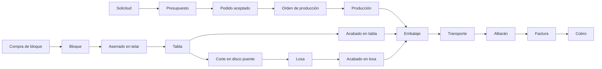

# Pulycort - Funcionamiento de la empresa

Esta bóveda resume la documentación disponible sobre Pulycort / INDASEL: proceso industrial, datos maestros, Odoo, máquinas, tarifas, clientes/proveedores, pagos, captación comercial y oportunidades de automatización.

## Navegación principal

- [[01 Empresa y modelo operativo]]
- [[02 Flujo pedido a cobro]]
- [[03 Cadena industrial bloque tabla losa]]
- [[04 Modelo Odoo variantes lotes]]
- [[05 Codificacion y atributos]]
- [[06 Materiales y familias]]
- [[07 Acabados trabajos y servicios]]
- [[08 Maquinas operaciones y produccion]]
- [[09 Tarifas costes y precios]]
- [[10 Clientes proveedores y pagos]]
- [[11 Comercial captacion y proyecto paralelo]]
- [[12 IA automatizacion y roadmap]]
- [[13 Puntos abiertos]]
- [[14 Glosario operativo]]
- [[99 Fuentes y cobertura]]

## Mapa rápido

## Lectura recomendada

Si quieres entender la empresa desde cero, empieza por [[01 Empresa y modelo operativo]], pasa a [[03 Cadena industrial bloque tabla losa]] y después a [[04 Modelo Odoo variantes lotes]]. Para parametrización y migración, la ruta es [[05 Codificacion y atributos]] -> [[06 Materiales y familias]] -> [[07 Acabados trabajos y servicios]] -> [[09 Tarifas costes y precios]].
