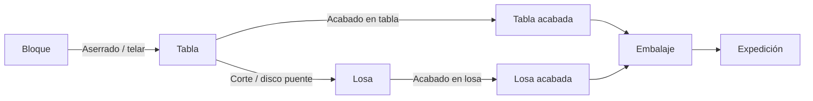

# Cadena industrial bloque tabla losa

La cadena física básica es:

## Bloque

El bloque es el material comprado. Procesos asociados:

- Recepción y clasificación.
- Refuerzo si tiene pelos/fisuras.
- Despunte para cuadrar bloques irregulares.
- Aserrado en telar.
- Trabajo con hilo o cortabloques cuando proceda.

## Tabla

La tabla sale del aserrado. Puede:

- Venderse en bruto.
- Recibir refuerzo, filtrado, masillado o acabado.
- Cortarse en losas.
- Pasar por pulidora de tabla.

## Losa

La losa suele ser producto final o semielaborado final. Puede:

- Recibir acabado.
- Biselarse, cortarse, escarfilase o trabajarse en taller.
- Embalarse en palet.
- Entregarse como producto propio o como servicio a terceros.

## Trazabilidad

En el cuestionario, la referencia PM se identifica como el número de lote. Ese lote enlaza el bloque original, las tablas resultantes, los palets/cajones y las losas. El número de lote es por tanto el hilo conductor para producción, consumos, incidencias, stock y Odoo.

## Datos industriales relevantes

- Máquina.
- Operario.
- Material.
- Número de lote.
- Número de tablas o losas.
- Largo, alto/ancho y grueso.
- Acabado u operación.
- Consumo eléctrico.
- Consumibles: malla en m2, productos químicos en litros.
- Eventos/incidencias.
- Palet/cajón de entrada y salida.
