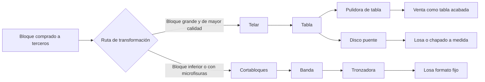

# Pulycort - Transcripción y síntesis de audios de cliente conocedor de la empresa

Fecha: 2026-06-10

## Fuentes

- `01_entrada/sobre pulytcort - cliente que conoce muy bien la empresa 01.ogg`
  - Duración: 5 min 15 s
  - Salida bruta: `04_analisis_y_entregables/outputs/cliente-conoce-pulycort-2026-06-10/audio-01/`
- `01_entrada/sobre pulytcort - cliente que conoce muy bien la empresa 02.ogg`
  - Duración: 6 min 45 s
  - Salida bruta: `04_analisis_y_entregables/outputs/cliente-conoce-pulycort-2026-06-10/audio-02/`
- `01_entrada/sobre pulytcort - cliente que conoce muy bien la empresa 03.ogg`
  - Duración: 4 min 24 s
  - Salida bruta: `04_analisis_y_entregables/outputs/cliente-conoce-pulycort-2026-06-10/audio-03/`

Transcripción automática con `faster-whisper`, modelo `small`, idioma español. La probabilidad de idioma detectada fue `1.0` en los tres audios. Conviene revisión humana antes de usar nombres propios, cifras o términos técnicos como fuente cerrada.

## Criterio de lectura

Este documento separa:

- **Afirmación de la fuente**: lo que dice el audio.
- **Inferencia**: lectura razonable a partir de lo dicho, pendiente de validar.
- **Pregunta abierta**: punto que conviene confirmar con dirección, producción, administración o documentación interna.

El informante habla desde conocimiento cercano de la empresa, pero también aporta valoraciones personales. Las opiniones sobre personas, estructura o rendimiento interno no deben convertirse en diagnóstico oficial sin contraste.

## Resumen ejecutivo

Los audios aportan una visión muy clara de Pulycort como empresa industrial que compra bloques de mármol a terceros, los transforma en tablas o losas y comercializa producto terminado o semielaborado con distintos acabados.

En producción, la fuente distingue dos rutas principales:

- **Telar**: usa bloques normalmente más grandes y caros. Produce tablas, habitualmente de 2 o 3 cm, que después pueden venderse como tabla o pasar por pulidora y otros acabados.
- **Cortabloques**: usa bloques más inferiores o con "pelos", entendidos como microfisuras. Produce bandas que después se trocean, por ejemplo en losa de 40 x 40.

La fuente subraya una diferencia económica importante: el telar tendría un rendimiento muy superior al cortabloques. Menciona aproximadamente 38-40 m2 por m3 en telar para 2 cm de espesor, frente a 24-26 m2 por m3 como máximo en cortabloques. Esta cifra es valiosa para el modelo de costes, pero debe verificarse con producción.

En comercialización, describe a Pulycort como una empresa históricamente "boutique": buena producción y presentación, pero poca estructura comercial agresiva. Según la fuente, tradicionalmente "la gente va a comprar" a Pulycort más que Pulycort salir a vender. Esto habría cambiado parcialmente en los últimos 6-8 años con los hermanos Cremades, especialmente en proyectos internacionales, y en los últimos 2-3 años con más actividad en redes sociales.

En administración, la fuente expresa una opinión crítica: ve la estructura administrativa sobredimensionada o poco optimizada, con personas de buen trato pero funciones que quizá podrían organizarse con más control, claridad y eficiencia. En el tercer audio matiza que quizá no se trata de eliminar gente, sino de reestructurarla o cambiar su foco. Esta parte debe tratarse como percepción subjetiva y usarla solo como señal para hacer un mapa real de roles, cargas de trabajo y procesos.

El tercer audio añade una propuesta estratégica concreta: si el punto fuerte de Pulycort es la elaboración y el producto final, la empresa podría reforzar su perfil de "boutique" mediante una exposición digital muy precisa del material disponible. La idea sería informatizar tabla a tabla, con número de bloque, fotos, medidas, defectos, virtudes, precio y disponibilidad en tiempo real.

## Producción

### Flujo operativo descrito

### Afirmaciones de la fuente

- Pulycort no tiene canteras. Compra en el exterior todos los bloques que transforma.
- La fuente recuerda que Pulycort cuenta con cuatro telares y un cortabloques, aunque lo formula "salvo que la memoria me falle".
- Los bloques para telar suelen ser más grandes, más buenos visualmente y más caros.
- Del telar se obtienen tablas, normalmente en 2 cm o 3 cm, aunque puede haber otros espesores si un pedido lo requiere.
- Las tablas pueden venderse como tabla acabada o pasar a disco puente para cortarse en losas, chapados o formatos a medida.
- Los acabados mencionados para tabla son pulido, apomazado, abujardado y envejecido.
- El apomazado se explica como un pulido mate, sin brillo.
- El cortabloques se usa para bloques más inferiores o con "pelos", entendidos como microfisuras internas.
- Del cortabloques salen bandas, por ejemplo de 40 cm de ancho y 2 cm de espesor, que luego se trocean en tronzadora para obtener losas 40 x 40.
- El rendimiento del telar se considera muy superior al del cortabloques.
- Rendimientos citados:
  - Telar: 38-40 m2 por m3 a 2 cm.
  - Cortabloques: 24-26 m2 por m3 como máximo.
- La fuente atribuye el menor rendimiento del cortabloques a tres factores: peor calidad del bloque, solera final que no se corta y mayor ancho de corte del disco.
- En el tercer audio, la fuente considera que parte de la maquinaria puede estar obsoleta, especialmente comparada con sistemas multihilo.
- Según la fuente, un multihilo podría cortar un bloque en 2-3 horas y llegar a 5-6 bloques al día, frente a telares tradicionales que podrían tardar 8-10 horas y cortar como mucho 2 bloques al día usando 24 horas.
- Aun con esa posible obsolescencia, la fuente afirma que Pulycort obtiene un producto final de primer orden: tablas bien cortadas y bien acabadas.

### Inferencias útiles

- Para Odoo y producción conviene modelar no solo el producto final, sino la **ruta de transformación**: bloque a tabla, tabla a losa, bloque a banda, banda a losa.
- El rendimiento esperado debe depender de máquina, espesor, calidad del bloque y ruta productiva.
- La trazabilidad bloque-tabla-losa debe conservar el origen de cada formato, porque la tabla puede venderse directamente o convertirse después en varios formatos.
- El concepto "pelos" puede ser un atributo operativo relevante de calidad o riesgo del bloque, especialmente si afecta a rendimiento, merma o elección de máquina.
- La comparación entre telar tradicional y multihilo puede servir para una futura evaluación de capacidad, cuellos de botella e inversión industrial, pero no debe tomarse como diagnóstico técnico cerrado sin datos internos.
- La calidad final de tabla y acabado aparece como una fortaleza diferencial que podría explotarse comercialmente con mejor presentación digital.

### Preguntas abiertas

- Confirmar número real y estado de telares, cortabloques, pulidoras, disco puente y tronzadora.
- Confirmar si las cifras de rendimiento 38-40 m2/m3 y 24-26 m2/m3 son medias reales, objetivos internos o reglas aproximadas del sector.
- Confirmar qué espesores son estándar y cuáles son especiales.
- Confirmar cómo se registra hoy la relación entre bloque, tabla, losa, palet, pedido y cliente.
- Confirmar si el defecto "pelos" aparece en alguna ficha de bloque, control de calidad o decisión de compra.
- Confirmar tiempos reales de corte por máquina, tiempos muertos entre bloques, capacidad diaria y coste por ruta.
- Confirmar si Pulycort ha evaluado o descartado tecnología multihilo y con qué criterio: coste, capacidad, tipo de material, mantenimiento, espacio o estrategia.

## Comercialización

### Afirmaciones de la fuente

- Pulycort habría carecido históricamente de una estructura de venta organizada y amplia.
- La fuente la define como "empresa boutique": producción importante y bien presentada, pero sin una red comercial grande.
- Según su percepción, tradicionalmente los clientes van a comprar a Pulycort, más que Pulycort salir activamente a vender.
- En los últimos 6-8 años la situación habría cambiado parcialmente con la incorporación de los hermanos Miguel Ángel y Javier Cremades, orientados a proyectos y mercados exteriores.
- Se citan ejemplos de proyectos en Dubái o Emiratos como tipo de oportunidad que podrían trabajar.
- En los últimos 2-3 años Pulycort se habría movido más en redes sociales y estaría obteniendo una cuota de mercado que antes no tenía.
- La fuente sigue considerando que Pulycort no es agresiva comercialmente frente a empresas con delegados, representantes y redes de venta repartidas por países.
- Menciona que quizá existan algunos agentes de venta, pero no los considera el centro de la estructura.
- También menciona a David Palazón como persona con clientes propios en distintos países.
- La fuente matiza que no necesariamente lo ve como un problema: puede funcionar bien así e incluso Pulycort podría no querer vender más.
- En el tercer audio, la fuente propone reforzar la presentación comercial del material disponible mediante un sistema digital muy detallado, casi como tienda online de bloques/tablas.
- La propuesta concreta es mostrar número de bloque, número de tablas, medidas, fotos tabla a tabla, defectos, virtudes, precio y disponibilidad.
- La fuente sugiere que, cuando un material se venda, se dé de baja y se publique el siguiente bloque o lote disponible.

### Inferencias útiles

- La empresa puede tener una tensión estratégica entre vender más y proteger capacidad operativa, calidad o forma de trabajo.
- Antes de plantear más captación conviene saber si el objetivo real es crecimiento, mejor margen, mejor mix de cliente, reducir dependencia de ciertos canales o simplemente ordenar el trabajo existente.
- Si Pulycort no quiere una red comercial pesada, tienen más sentido herramientas de captación selectiva, autoservicio, prescripción técnica o proyectos digitales acotados.
- Las redes sociales parecen un canal emergente que merece medición: origen del lead, tipo de cliente, presupuesto, conversión y margen.
- La idea de catálogo vivo encaja mejor con una estrategia comercial selectiva que con una red de vendedores agresiva: permite vender mejor lo ya producido y presentar la calidad de Pulycort sin depender tanto de desplazamientos comerciales.
- El catálogo tabla a tabla podría convertirse en un puente entre producción, trazabilidad, stock, web, ventas y Odoo.

### Preguntas abiertas

- ¿Quiere Pulycort vender más o vender mejor?
- ¿Qué mercados, productos o tipos de cliente son estratégicos?
- ¿Qué papel tienen actualmente los hermanos Cremades, David Palazón, agentes externos, web, redes, llamadas y clientes recurrentes?
- ¿Hay CRM o registro fiable de oportunidades por canal?
- ¿Qué capacidad comercial real existe para atender más leads sin deteriorar respuesta ni producción?
- ¿Existe ya inventario digital de bloques/tablas con fotos y medidas? Si existe, ¿qué cobertura real tiene y por qué no se usa como canal comercial principal?
- ¿Qué campos harían falta para publicar stock con confianza: fotos, medidas, acabado, calidad, defecto, ubicación, precio, reserva, pedido asociado?

## Administración y organización interna

### Afirmaciones de la fuente

- La fuente percibe una "pata coja" en administración.
- En el tercer audio, la fuente matiza que quizá no se trata de eliminar gente, sino de reestructurarla o cambiarla de foco.
- Describe la administración como un área con buena gente, pero quizá más parecida a una estructura poco optimizada que a un sistema profesionalizado.
- Menciona funciones concretas:
  - Control financiero, cobros y seguimiento de deudores.
  - Nóminas.
  - Compras de bloques o visitas a canteras.
  - Presupuestos y trato con clientes desde ventas.
  - Control de camiones, contenedores, fotos y cargas.
- Valora positivamente a algunas personas por trato o desempeño, pero cuestiona si la estructura completa está sobredimensionada.
- Su conclusión subjetiva es que con menos gente, más control y más organización interna quizá Pulycort podría ser más eficaz.

### Inferencias útiles

- Hay oportunidad de mapear procesos administrativos reales antes de automatizar.
- El problema puede no ser "personas", sino claridad de roles, indicadores, duplicidades, dependencias familiares, herramientas y circuitos de validación.
- La integración con Odoo debería ir acompañada de un mapa de responsabilidades: quién crea datos, quién valida, quién corrige, quién factura, quién controla cobro, quién libera pedidos y quién gestiona logística.
- Una posible reorientación del personal administrativo podría ser convertir tareas dispersas en mantenimiento de datos operativos y comerciales: inventario, fotos, medidas, reservas, cargas, documentación y estado de pedidos.

### Preguntas abiertas

- ¿Qué tareas hace realmente cada persona del área administrativa y comercial-administrativa?
- ¿Qué tareas se repiten, se duplican o dependen de memoria personal?
- ¿Qué controles existen hoy para cobros, cargas, presupuestos, pedidos, compras y nóminas?
- ¿Qué información se introduce en Odoo, qué queda en Excel/correo/WhatsApp y qué no se registra?
- ¿Qué parte de la administración es crítica para trazabilidad industrial y qué parte es soporte general?
- ¿Qué personas podrían mantener un catálogo digital vivo sin añadir carga improductiva?

## Implicaciones para Odoo, máquinas e IA

### Modelo de datos operativo

La información de producción refuerza la necesidad de modelar:

- Bloque comprado y proveedor/origen.
- Calidad o estado del bloque, incluyendo defectos operativos si existen.
- Máquina o ruta: telar, cortabloques, disco puente, pulidora, tronzadora.
- Salida intermedia: tabla, banda, losa, chapado, palet.
- Espesor, ancho, largo, acabado, formato y unidad.
- Rendimiento esperado y real por m3, m2, espesor y máquina.
- Mermas: solera, ancho de corte, rotura, recortes.
- Relación entre salida física y pedido/cliente.
- Inventario comercial publicable tabla a tabla: bloque, tabla, medidas, acabado, fotos, defectos, virtudes, precio, disponibilidad, reserva y baja por venta.

### Comercialización

La parte comercial sugiere que cualquier sistema de IA o captación debe ser selectivo:

- Medir antes de escalar.
- Capturar origen del lead y calidad de oportunidad.
- Priorizar proyectos que encajen con capacidad productiva y margen.
- Evitar generar volumen comercial que la estructura no quiera o no pueda absorber.
- Crear un escaparate digital de stock real puede ser una vía intermedia: no obliga a montar una red comercial mundial, pero sí mejora la exposición del producto terminado.

### Administración

La parte administrativa sugiere un trabajo previo de mapeo:

- Roles reales.
- Circuitos de aprobación.
- Información que se pierde entre producción, logística, ventas y cobro.
- Indicadores mínimos: pedidos vivos, cargas pendientes, cobros, presupuestos, incidencias, productividad administrativa.
- Posible nuevo rol de administración/datos: alimentar y verificar el inventario digital, asociando cada tabla a bloque, fotos, medidas y estado comercial.

## Términos o fragmentos a revisar manualmente

- "cortablo" en la transcripción debe interpretarse probablemente como **cortabloques**.
- "pelos" se explica en el audio como microfisuras del bloque.
- "chapados" se usa como piezas o cortes a medida para fachadas u otros revestimientos.
- "se han promulgado mucho en redes sociales" podría ser "se han promocionado" o "se han prodigado"; revisar a oído si se quiere cita literal.
- "multi hilo" debe revisarse como **multihilo**, tecnología de corte alternativa a los telares tradicionales.
- "número de bloquen" debe interpretarse probablemente como **número de bloque**.
- "crema marcil" debe interpretarse probablemente como **Crema Marfil**.
- "publicor" debe interpretarse como **Pulycort**.
- Revisar grafía de nombres propios: Cremades, David Palazón, Carlos Palazón, Ángel Ramón, Loli/Loly, María José.

## Transcripción completa

### Audio 01

**00:00:02.190 - 00:00:17.290**  
Hola, buenos días. Voy a hablar un poquito de Pulycort, diferenciar entre producción, comercialización y administración en principio, luego iremos añadiendo datos.

**00:00:17.290 - 00:00:33.440**  
Bien, en producción hay que tener en cuenta que Pulycort no tiene canteras, con lo cual todos los bloques de mármol que consume para su elaboración y posterior venta

**00:00:33.440 - 00:00:36.440**  
son bloques que compra en el exterior.

**00:00:36.440 - 00:00:47.050**  
Bien, Pulycort cuenta, salvo que la memoria me falle, con cuatro telares y un cuarto de bloques, ¿vale?

**00:00:47.050 - 00:01:01.560**  
Los bloques que se utilizan para los telares son bloques normalmente más grandes, más hermosos, consecuentemente más caros, de los que se obtienen tablas.

**00:01:01.560 - 00:01:12.750**  
Tablas normalmente en dos centímetros de espesor, o tres, o tal vez otros espesores, si es que hay pedidos que requieran de otros espesores.

**00:01:12.750 - 00:01:28.820**  
Y tienen un cortablo que es que esto se come los bloques, digamos, más de segundas, más, como se suele decir, con pelos, que pelos traducido al lenguaje marmoreo

**00:01:28.820 - 00:01:36.820**  
son como microfisuras que hacen que el bloque esté más roto, aunque no se vea, ¿vale?

**00:01:36.820 - 00:01:50.260**  
Entonces, de los telares obtienen tablas que se venden con sus acabados correspondientes, es decir, que se pasan por la pulidora de tabla posteriormente

**00:01:50.260 - 00:02:03.680**  
y obtenemos tablas pulidas o apomazadas, apomazado quiere decir que es un pulido mate, vamos, sin brillo, o u otros acabados, como puede ser abujardado o envejecido, ¿vale?

**00:02:03.680 - 00:02:15.480**  
Las tablas se pueden vender directamente como tal, con lo cual se ponen a la venta, una vez tratadas con sus acabados, que acabo de decir

**00:02:15.480 - 00:02:28.610**  
y bueno, pues los clientes se las llevan pulidas normalmente o con otros acabados, o se destinan a partir de las tablas, se meten en un discopuente

**00:02:28.610 - 00:02:41.610**  
y se trocean, se trocean obteniendo losas de diversos tamaños o chapados, ¿no? Chapados, cuando hablamos de chapados son

**00:02:42.610 - 00:02:53.670**  
material, las tablas cortadas en distintos tamaños, un poco corta a medida, ¿no? Es decir, de cada tabla pueden salir varios formatos distintos

**00:02:53.670 - 00:03:04.670**  
para un chapado, que son fachadas, por ejemplo, que se utilizan con medidas variopintas, cada una es un tamaño distinto o no, o grandes medidas, ¿vale?

**00:03:05.670 - 00:03:17.500**  
En fin, entonces tenemos la tabla para la venta o la tabla para la losa, en la que se ha utilizado un discopuente que ha cortado todo el material.

**00:03:17.500 - 00:03:44.480**  
Bien, las tablas, una vez obtenidas después del lab de pulir, se ponen al mercado, a la venta, vienen en tabla o si se elaboran en el discopuente

**00:03:44.480 - 00:03:55.480**  
pues ya directamente se trocean y se venden según los pedidos que se requieran. Del corta a bloques se obtiene, es otro proceso totalmente distinto,

**00:03:55.480 - 00:04:09.480**  
en el cual un bloque normalmente inferior se mete al corta a bloques y se obtienen bandas de un ancho específico, digamos 40 centímetros de ancho,

**00:04:09.480 - 00:04:18.480**  
de 2 centímetros de espesor, se van sacando las bandas que se meten en una troceadora, que se llama, una tronzadora, exactamente,

**00:04:18.480 - 00:04:27.480**  
y de ahí, sobre una banda de 40 de ancho, por ejemplo, se van partiendo a 40 por 40 y se obtiene losa de 40 por 40.

**00:04:27.480 - 00:04:34.480**  
Es importante señalar que el rendimiento de un telar es infinitamente superior al del corta a bloques.

**00:04:34.480 - 00:04:41.610**  
Normalmente un telar puedes obtener 38 a 40 metros cuadrados por metro cúbico, en 2 centímetros de espesor,

**00:04:41.610 - 00:04:50.700**  
y de un corta a bloques, como mucho, puedes obtener 24, 25 o 26 metros cuadrados por metro cúbico, por muchas razones,

**00:04:50.700 - 00:04:57.700**  
porque el bloque es inferior, porque al final te queda una solera que nunca se corta, que es el final del bloque,

**00:04:57.700 - 00:05:07.700**  
digamos que te queda y sobre un desperdicio puro y duro, o incluso el ancho del corte del disco es superior,

**00:05:07.700 - 00:05:10.700**  
con lo cual tienes un rendimiento inferior, ¿vale?

**00:05:10.700 - 00:05:14.700**  
Bueno, sigo en otro vídeo, en otro de esto, chao.

### Audio 02

**00:00:02.100 - 00:00:08.810**  
Bien, con respecto a la comercialización, bajo mi punto de vista, Pulycort siempre ha

**00:00:08.810 - 00:00:17.670**  
dolecido de una estructura de venta organizada. Prácticamente a Pulycort, a nivel comercial,

**00:00:17.670 - 00:00:24.790**  
ha sido una empresa boutique, es decir, nunca ha tenido una red de ventas importante, pero

**00:00:24.790 - 00:00:31.580**  
sí que ha tenido una producción importante y de alguna manera bien presentada, ¿vale?

**00:00:31.580 - 00:00:38.900**  
Con lo cual, yo siempre he entendido que a Pulycort va la gente a comprar, a Pulycort nunca sale

**00:00:38.900 - 00:00:46.710**  
a vender, excepto estos últimos años, digamos, desde hace 6, 7 años, 8 años, en los que por

**00:00:46.710 - 00:00:53.070**  
un lado con la incorporación de los hermanos cremades, digamos, han salido a la venta un

**00:00:53.070 - 00:01:00.510**  
poco más y están ofreciendo sus productos en otros mercados, sobre todo, que es lo

**00:01:00.550 - 00:01:05.350**  
que hacen los hermanos cremades a nivel de proyectos, es decir, pues hacer una obra en

**00:01:05.350 - 00:01:14.820**  
Dubai o hacer un enemirato, un chalet o una organización o lo que sea, ¿vale?

**00:01:14.820 - 00:01:21.420**  
Los hermanos Miguel Ángel y Javier cremades son, en ese aspecto, pues un puntal bastante

**00:01:21.420 - 00:01:29.020**  
importante. Últimamente, pero más recientemente, digamos, dos, tres años, se han promulgado

**00:01:29.060 - 00:01:33.540**  
mucho en las redes sociales cada vez más y de ahí están obteniendo una cuota de

**00:01:33.540 - 00:01:39.530**  
mercado que nunca han tenido, no es hasta que puntó a nivel más particulares, más de

**00:01:39.530 - 00:01:46.490**  
gente que va entrando a través de las redes y bueno, pues ahí están. Pero sigo

**00:01:46.490 - 00:01:53.930**  
pensando que Pulycort nunca ha sido una empresa agresiva en cuanto a la

**00:01:53.930 - 00:01:58.570**  
comercialización, así como otras empresas que tienen sus redes de ventas

**00:01:58.610 - 00:02:03.650**  
distribuidas por todo el mundo y con sus delegados en distintos países y

**00:02:03.650 - 00:02:09.970**  
representantes dando la vara en todos sus países, en todos sus zonas de

**00:02:09.970 - 00:02:20.630**  
influencia. Pulycort nunca ha tenido ese tipo de estructura y, bueno, parece que

**00:02:20.630 - 00:02:24.070**  
ha funcionado bien, ¿vale? O sea, tampoco hay que criticarlo mucho, pero así ha

**00:02:24.790 - 00:02:30.580**  
sido. Es posible que tengan algunos agentes de venta por ahí, pero no es lo más

**00:02:30.580 - 00:02:35.580**  
importante. Bueno, ahora es verdad que los hermanos cremanes han contribuido a

**00:02:35.580 - 00:02:40.900**  
fomentar las ventas de Pulycort, pero tampoco viajan mucho. A excepción de algún

**00:02:40.900 - 00:02:45.940**  
viaje puntual, para alguna gestión puntual, estos suelen estar siempre en

**00:02:45.940 - 00:02:52.900**  
sus oficinas de la romana y se mueven a nivel de internet, a nivel de redes, a

**00:02:52.900 - 00:02:59.710**  
nivel de correos electrónicos y teléfono y poco más. Es verdad que David

**00:02:59.710 - 00:03:06.550**  
Palazón, socio de Juan Antonio, es muy bueno y también tiene sus clientes

**00:03:06.550 - 00:03:13.950**  
propios en distintos países que gestiona, pero son, digamos, acciones

**00:03:13.950 - 00:03:19.410**  
puntuales y, bueno, no sé hasta qué punto es cuestión de criticar este

**00:03:19.410 - 00:03:27.410**  
tema, puesto que si les va bien así, tal vez sea una estructura bien, no haya que

**00:03:27.410 - 00:03:33.530**  
fomentarla de otra manera e, incluso, a lo mejor Pulycort no quiere vender más, que

**00:03:33.530 - 00:03:41.720**  
puede ser. Vale, pues nada, no es cuestión de lo digo, pero no lo crítico, ¿vale?

**00:03:41.720 - 00:03:48.140**  
Bien, con el tema de la administración, yo siempre he pensado que Pulycort tiene

**00:03:48.180 - 00:03:53.780**  
una patacoja en la administración, puesto que a mí me parece que más que una

**00:03:53.780 - 00:03:59.730**  
administración aquello es una ONG. Yo conozco particularmente a todas las

**00:03:59.730 - 00:04:04.980**  
personas que trabajan allí, muy buena gente, nada que decirle ellos, pero, por

**00:04:04.980 - 00:04:10.100**  
ejemplo, por decir algo, Rafa vino importado de Monforte. Monforte cerró la

**00:04:10.100 - 00:04:14.020**  
fábrica donde había un oficinista en ese momento que era Rafa y se le dio

**00:04:14.020 - 00:04:26.010**  
trabajo en la romana, por bien. En la romana pues está, por decir algo, Ángel Ramón,

**00:04:26.010 - 00:04:31.740**  
director o director, bueno, financiero de la empresa, pues yo que sé, pues bien,

**00:04:31.740 - 00:04:36.900**  
llevar a sus controles, se pasará el día dando la vara a ver quién le debe

**00:04:36.900 - 00:04:43.180**  
dinero y quién no y dándole por saco y controlando ese tipo de cosas que es

**00:04:43.220 - 00:04:49.350**  
necesaria, pero, o fin, no sé, se podría tal vez gestionar desde otro

**00:04:49.350 - 00:04:53.710**  
perspectiva. También está Loli, la hermana de Juan Antonio, pues chica muy

**00:04:53.710 - 00:05:01.100**  
maja, muy irrespetable, vale, hace gestiones de nómina, bueno, Carlos Palazón,

**00:05:01.100 - 00:05:06.930**  
hermano de David, nunca ha sabido lo que hace y lo sigo sabiendo, vale, se supone

**00:05:06.930 - 00:05:14.570**  
que este va a comprar bloques, alguna cantera y demás, bien, es una gestión

**00:05:14.650 - 00:05:23.330**  
que no sé hasta qué punto es rentable ni sea muy válida, pero bueno,

**00:05:23.330 - 00:05:31.610**  
así es, es hermano del jefe y chipón. Mare José, adjunta a tema de ventas,

**00:05:32.670 - 00:05:38.550**  
está hace presupuestos y tiene, digamos, trato indirecto con clientes o trato

**00:05:38.550 - 00:05:43.440**  
directo, pues vale, bien, digamos que está en el departamento de ventas,

**00:05:43.480 - 00:05:47.760**  
pues es el que hay que fomentar esta chica, pues la verdad es que lo hace bien y no hay

**00:05:47.760 - 00:05:55.450**  
mucho que decir. Veo que la administración está un poco, no digo

**00:05:55.450 - 00:06:03.510**  
caótica, no sé ya la frase, pero infravalorada, infrautilizada, también está

**00:06:03.510 - 00:06:09.990**  
Antonio Abad, un chaval excepcional, muy majo, controla los camiones y los

**00:06:09.990 - 00:06:14.630**  
contenedores cuando salen, le hace dos fotos y lleva un pequeño control o gran

**00:06:14.630 - 00:06:22.200**  
control de las cargas, pero bueno, no sé hasta qué punto hace falta tanta gente

**00:06:22.200 - 00:06:31.650**  
para todas estas cosas, vale, para mí el publicor en este aspecto está, no sé,

**00:06:31.650 - 00:06:37.130**  
sobredimensionada, creo que con menos gente y más control y más organización a

**00:06:37.130 - 00:06:45.100**  
nivel interno podría ser incluso más eficaz. Bueno, sigo con otro, chao.

### Audio 03

**00:00:02.380 - 00:00:07.800**  
Bien, voy a dar alguna idea más que se me viene en la cabeza, con respecto a Pulycort.

**00:00:07.800 - 00:00:19.420**  
A ver, tal vez no sea cuestión de eliminar gente del tema administrativo, tal vez sea una cuestión

**00:00:19.420 - 00:00:27.950**  
de reestructurar a esta gente o cambiarla de foco, por decirlo así, cosa que va a ser muy

**00:00:27.950 - 00:00:33.870**  
difícil, muy complicado y la gente está acostumbrada a sus cosas y tal, pero bueno,

**00:00:33.870 - 00:00:46.090**  
por decir, como entiendo que Pulycort, su punto fuerte, de alguna manera, es la elaboración

**00:00:46.090 - 00:00:53.760**  
que aunque voy a hacer un paréntesis aquí, creo que tiene máquinas un tanto obsoletas, ya,

**00:00:53.760 - 00:00:59.840**  
por ejemplo los telares, los telares ahora mismo existen los multi hilos, que un multi

**00:00:59.840 - 00:01:06.860**  
hilo es una pasada, te corto un bloque, un bloque en tablas, te lo puedo hacer en un

**00:01:06.940 - 00:01:13.380**  
par de horas, dos, tres horas frente a los telares que tiene Pulycort o todo el mundo en la zona

**00:01:13.380 - 00:01:19.980**  
de novela, que pueden tardar ocho horas, diez horas o así, es decir, un multi hilo te

**00:01:19.980 - 00:01:28.340**  
puede cortar cinco o seis bloques al día frente a un telar que te corta como mucho dos bloques

**00:01:28.340 - 00:01:33.990**  
al día, empleando las 24 horas, porque también hay tiempos muertos entre bloque y bloque

**00:01:34.030 - 00:01:39.310**  
que hay que sacar, poner y tal. Bueno, esto entre paréntesis, o sea, de alguna manera estoy diciendo

**00:01:39.310 - 00:01:46.310**  
que parte de la maquinaria puede estar obsoleta, pero una vez dicho esto, aún así Pulycort

**00:01:46.310 - 00:01:55.810**  
obtiene un producto final de primer orden, unas tablas muy bien cortadas, muy bien pulidas,

**00:01:55.810 - 00:02:01.440**  
como a pomazadas o según el acabado que se le tenga que dar, y tal vez a lo mejor

**00:02:01.440 - 00:02:06.640**  
Pulycort lo que tiene que hacer es una buena presentación de sus productos, darle bombo a

**00:02:06.640 - 00:02:15.630**  
su boutique, es decir, hacer una exposición bestial del material que tiene, informatizar

**00:02:15.630 - 00:02:22.890**  
todo eso, incluso tabla a tabla, meterla en el ordenador, meterla a tal y publicitar a

**00:02:22.890 - 00:02:29.530**  
tiempo real en todo el mundo, en todos los clientes, las tablas o las tablas o el material

**00:02:29.610 - 00:02:38.650**  
que tenga la venta, pero no como algo genérico, sino exactamente número de bloquen, con tantas

**00:02:38.650 - 00:02:45.450**  
tablas, con tantas medidas, con estos formatos y con estas fotos y estas características, esto sería

**00:02:45.450 - 00:02:50.610**  
un tema bastante complejo a realizar, que ellos yo sé que ya empezaron en su día a hacer algo así,

**00:02:50.610 - 00:02:57.670**  
no sé cómo lo llevan, pero puede ser interesante, o sea, vender al mercado ya, decir, bueno,

**00:02:57.710 - 00:03:04.470**  
quiero el bloque 2528 que tiene, que se compone de 50 tablas pulidas de crema

**00:03:04.470 - 00:03:11.790**  
marcil y estoy viendo la foto de tabla a tabla con las medidas, con los defectos, con las virtudes

**00:03:11.790 - 00:03:19.110**  
y con el precio y todo y bueno, y en el momento estos ha vendido se la de baja y se pone el

**00:03:19.110 - 00:03:24.990**  
siguiente bloque, sería una opción, u otros, o sea, hacer como una tienda online, porque ellos

**00:03:24.990 - 00:03:30.950**  
son muy buenos en ese aspecto, en la producción y esto, si eso lo consiguen llevar a buen término

**00:03:30.950 - 00:03:43.750**  
y fomentar y presentar debidamente en todo el mundo, vía informática y vía redes o como se

**00:03:43.750 - 00:03:50.600**  
quiera hacer, pues sería interesante a través de su web, u otras fórmulas que pueden existir

**00:03:50.600 - 00:04:03.360**  
ahora, en fin, es una idea, que más, nada, sigo pensando que le falla un poco el tema a publicor

**00:04:03.360 - 00:04:12.560**  
de la gestión comercial a nivel mundial, pero tal vez esto sea asumible y ellos no quieran

**00:04:12.560 - 00:04:20.270**  
vender más, puede ser, de hecho creo que van por ahí los tiros o no, fin, qué hablen y qué digan,

**00:04:20.270 - 00:04:23.380**  
bueno, sigo para adelante, venga, hasta ahora.
