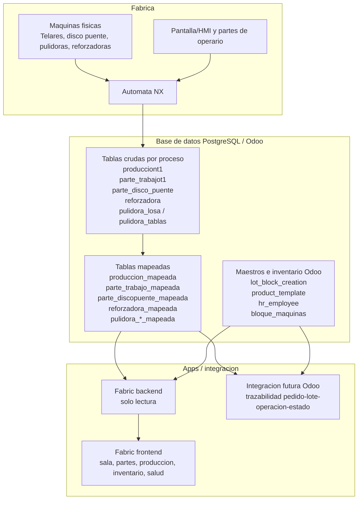

# Esquema de gestion de datos de maquinas, NX, Fabric y Odoo

Fecha: 2026-06-14  
Estado: esquema operativo basado en la investigacion de tablas Fabric y en la aclaracion de Angel sobre el automata NX.

## Idea principal

Las maquinas de fabrica no parecen gestionarse como "una tabla por telar". El patron que se ve en la base de datos es:

1. La maquina o el operario genera una lectura/parte.
2. El automata NX recibe o concentra esa informacion.
3. NX escribe en la base de datos.
4. La base guarda datos crudos en tablas por tipo de proceso.
5. Una capa mapeada normaliza fechas, tipos, unidades, IDs y campos derivados.
6. Fabric consume sobre todo las tablas `_mapeada` en solo lectura.
7. Odoo aporta maestros e inventario para cruzar PM/lote, materiales, empleados y bloques.

## Esquema visual

## Separacion real de los telares

El dato clave es que la separacion se hace por campo, no por tabla.

| Capa | Tabla | Campo que identifica maquina |
| --- | --- | --- |
| Cruda produccion telares | `producciont1` | `telar_n` |
| Mapeada produccion telares | `produccion_mapeada` | `telar_n` |
| Cruda partes telares | `parte_trabajot1` | `n_telar` |
| Mapeada partes telares | `parte_trabajo_mapeada` | `n_telar` |
| Cruda disco puente | `parte_disco_puente` | `disco_puente_n` |
| Mapeada disco puente | `parte_discopuente_mapeada` | `disco_puente_n` |

Por tanto, `producciont1` y `parte_trabajot1` no deben interpretarse como "solo Telar 1". Contienen registros de varios telares y cada fila indica la maquina.

## Que aporta cada capa

### 1. Maquina / HMI

Origen de datos operativo:

- Lecturas automaticas de produccion: potencia, velocidad, altura, consumo, incidencia, PM/lote, medidas.
- Partes de operario: colocacion, aserrado, salida, paquetes, tablas, m2, operarios, material.
- Eventos/incidencias: paros, roturas, cambios o estados de trabajo.

### 2. Automata NX

Hecho comunicado por Angel: las maquinas pasan por un automata NX y ese automata escribe en la base de datos.

Pendiente de confirmar con TotWare/Indasel:

- Si NX escribe directamente en las tablas crudas.
- Si hay un servicio intermedio antes de Odoo/PostgreSQL.
- Si el mapeador `_mapeada` forma parte de TotWare, de Odoo o de otro proceso.

### 3. Tablas crudas

Son utiles como fuente forense, pero no son la mejor fuente para Fabric.

Ejemplos:

- `producciont1`
- `parte_trabajot1`
- `parte_disco_puente`
- `reforzadora`
- `pulidora_losa`
- `pulidora_tablas`

Problemas vistos:

- Fechas antiguas como enteros y sin ano claro.
- Tipos menos limpios.
- Algunas columnas sin normalizar.
- IDs que no casan necesariamente con las tablas mapeadas.

### 4. Tablas mapeadas

Son la capa recomendada para Fabric y para cualquier integracion funcional.

Ejemplos:

- `produccion_mapeada`
- `parte_trabajo_mapeada`
- `parte_discopuente_mapeada`
- `reforzadora_mapeada`
- `pulidora_losa_mapeada`
- `pulidora_tablas_mapeada`

Ventajas:

- Tienen `fecha_hora` real o reconstruida.
- Normalizan tipos.
- Incorporan campos derivados como m2/m3, `id_bloque`, `bloque_existe`, etc.
- Permiten filtrar por maquina con `telar_n`, `n_telar` o `disco_puente_n`.

### 5. Maestros Odoo

Odoo no solo recibe datos: tambien da contexto.

Tablas clave:

- `lot_block_creation`: alta de PM/bloques en inventario.
- `product_template`: nombre/codigo de materiales.
- `hr_employee`: empleados/operarios.
- `bloque_maquinas`: padron real de bloques/PM conocidos por maquinas.

Estos maestros sirven para traducir IDs, validar si un PM existe, resolver materiales y enlazar inventario con produccion.

### 6. Fabric

Fabric debe tratar la base como fuente de solo lectura.

Uso correcto:

- Leer `produccion_mapeada` para lecturas de los telares.
- Leer `parte_trabajo_mapeada` para partes de trabajo de telares.
- Leer `parte_discopuente_mapeada` para disco puente.
- Cruzar con `lot_block_creation`, `product_template`, `hr_employee` y `bloque_maquinas`.

No debe:

- Inventar valores cuando una tabla no los tiene.
- Asumir que `producciont1` significa Telar 1.
- Consumir las crudas como fuente principal salvo auditoria o contraste.

## Pendientes criticos

- Confirmar oficialmente la arquitectura NX -> base de datos -> mapeador.
- Pedir a TotWare/Indasel el significado historico del sufijo `t1`.
- Confirmar la tabla de codigos de incidencias y operaciones.
- Resolver calidad de `parte_trabajo_mapeada`: `n_telar` corruptos, filas sin telar y fechas futuras.
- Confirmar que identificador final conectara maquina, PM/lote, bloque fisico, tabla/losa, pedido, operacion y estado.

## Resumen en una frase

El sistema parece estar organizado por flujo de maquina/proceso y por eventos en una base comun: NX escribe datos operativos, las tablas crudas los reciben, las `_mapeada` los limpian/normalizan, Odoo aporta maestros e inventario, y Fabric debe leer esa capa mapeada para construir trazabilidad y control de produccion.
