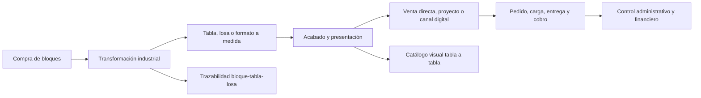
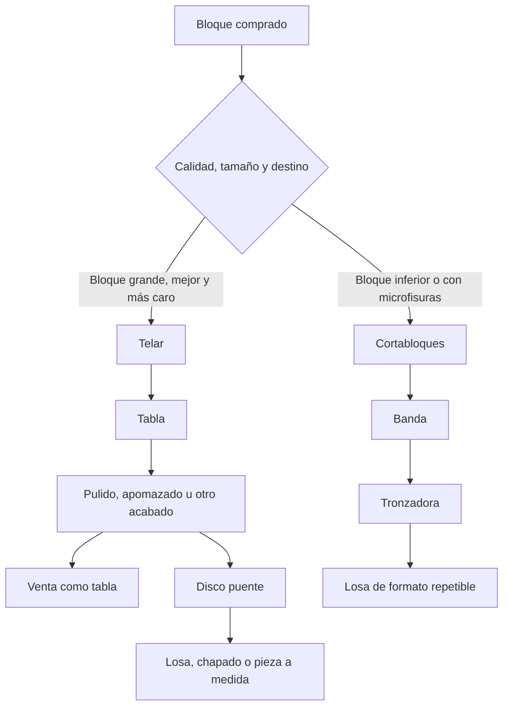
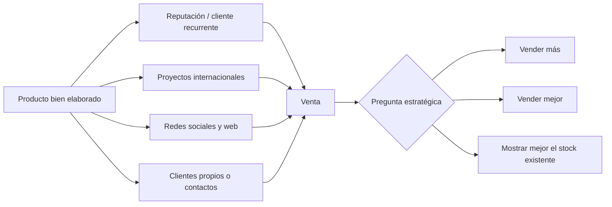
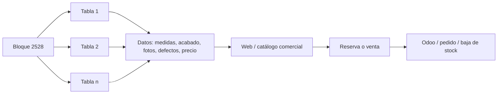

# Pulycort - Modelo esquemático de empresa a partir de audios de cliente conocedor

Fecha: 2026-06-10

## Fuentes y alcance

Este documento resume de forma estructurada los tres audios recibidos en `01_entrada/`:

- `sobre pulytcort - cliente que conoce muy bien la empresa 01.ogg`
- `sobre pulytcort - cliente que conoce muy bien la empresa 02.ogg`
- `sobre pulytcort - cliente que conoce muy bien la empresa 03.ogg`

La transcripción completa y el análisis detallado están en `04_analisis_y_entregables/informes/audios_cliente_conoce_pulycort_2026-06-10.md`.

El objetivo aquí no es reproducir todo lo dicho, sino construir una lectura sencilla de cómo funciona Pulycort: qué compra, qué transforma, qué vende, cómo se comercializa y dónde aparecen las oportunidades de orden, trazabilidad y digitalización.

## Idea central

Pulycort se entiende mejor como una empresa industrial-boutique de piedra natural. No parte de cantera propia, sino de bloques comprados a terceros. Su valor principal está en seleccionar, transformar, acabar, presentar y vender mármol en formatos útiles para cliente profesional o proyecto.

La empresa parece fuerte en producto físico y elaboración. Su punto menos desarrollado, según la fuente, no sería tanto la capacidad de producir, sino convertir esa capacidad en un sistema comercial y administrativo más visible, ordenado y medible.

## Cómo se genera valor

| Fase | Qué ocurre | Qué valor aporta Pulycort | Qué dato conviene controlar |
| --- | --- | --- | --- |
| Compra | La empresa compra bloques fuera; no explota cantera propia. | Selección de material y decisión de ruta productiva. | Proveedor, bloque, material, calidad, coste y defectos. |
| Transformación | El bloque pasa por telar o cortabloques según calidad, tamaño y destino. | Conversión del bloque en tabla, banda o losa. | Máquina, tiempo, espesor, rendimiento y merma. |
| Acabado | Las tablas o losas se pulen, apomazan u obtienen otros acabados. | Producto final vendible y presentación diferenciada. | Acabado, calidad visual, defectos, medidas y fotos. |
| Comercialización | La venta puede llegar por cliente recurrente, proyecto, red informal, redes o web. | Capacidad de vender producto industrial con imagen de boutique. | Canal, cliente, país, presupuesto, estado y margen. |
| Administración | Se gestionan cobros, nóminas, compras, presupuestos, cargas y documentación. | Soporte operativo para que producción y venta no se desordenen. | Responsables, tareas, validaciones, pedidos, cargas y cobros. |

## Producción: dos rutas principales

La fuente diferencia dos caminos industriales. Esta distinción es clave porque cada ruta genera producto, rendimiento y coste distinto.

### Ruta telar

El telar se asocia a bloques más grandes, mejores y más caros. Produce tablas, normalmente en 2 cm o 3 cm, que pueden venderse como tabla acabada o pasar después a disco puente para generar losas, chapados y formatos a medida.

La fuente cita un rendimiento orientativo de 38-40 m2 por m3 en 2 cm. Este dato debe validarse, pero es muy útil para pensar en costes, márgenes y comparación entre máquinas.

### Ruta cortabloques

El cortabloques se asocia a bloques más inferiores o con "pelos", entendidos en el audio como microfisuras. Produce bandas que luego se trocean en tronzadora. El ejemplo citado es una banda de 40 cm de ancho y 2 cm de espesor que termina en losa 40 x 40.

La fuente cita un rendimiento mucho menor, alrededor de 24-26 m2 por m3 como máximo. Lo atribuye a peor calidad del bloque, solera final no aprovechada y mayor ancho de corte.

## Producto: lo que realmente se vende

Pulycort no vende solo "mármol". Vende estados del material en distintos niveles de transformación.

| Estado | Origen | Uso comercial | Riesgo si no se controla |
| --- | --- | --- | --- |
| Bloque | Compra externa | Materia prima y unidad de trazabilidad inicial. | No saber qué bloque generó qué tabla, losa, coste o incidencia. |
| Tabla | Telar | Venta directa o entrada a procesos posteriores. | Perder fotos, medidas, defectos y disponibilidad real. |
| Banda | Cortabloques | Intermedio para losas de formato repetible. | No medir rendimiento ni merma por ruta. |
| Losa | Disco puente, tronzadora u otros cortes | Producto final para pavimento, chapado, obra o pedido. | Desconectar formato final de bloque, pedido o cliente. |
| Chapado / a medida | Tabla cortada según necesidad | Fachadas, proyectos y formatos variables. | Dificultad para presupuestar, reservar y documentar. |

La lectura más importante es que el producto comercial y el producto industrial no siempre son lo mismo. Una tabla puede ser producto final o materia prima de otra venta. Por eso, la trazabilidad debe seguir el material aunque cambie de estado.

## Comercialización: empresa boutique más que red agresiva

La fuente describe a Pulycort como una empresa con buena producción y buena presentación, pero sin una red comercial pesada. La idea más repetida es que históricamente "la gente va a comprar" a Pulycort más que Pulycort salir a vender.

Esto no se plantea necesariamente como fallo absoluto. Puede ser una elección explícita o implícita: vender sin sobredimensionar la estructura, mantener cierto control sobre la capacidad productiva o priorizar relaciones y proyectos concretos.

En los últimos años aparecen tres movimientos comerciales:

| Movimiento | Qué representa | Lectura útil |
| --- | --- | --- |
| Hermanos Cremades | Más salida a proyectos y mercados exteriores. | Refuerzo comercial por proyectos, no necesariamente red masiva. |
| Redes sociales | Entrada de clientes o interés que antes no existía. | Canal emergente que debe medirse por calidad, no solo por alcance. |
| Clientes propios / contactos | Relaciones comerciales personales en distintos países. | Activo valioso, pero difícil de escalar si no se sistematiza. |

## Administración: de coste percibido a sistema de control

La fuente es crítica con la administración, pero el tercer audio introduce un matiz importante: quizá no se trata de eliminar personas, sino de cambiar el foco de parte del trabajo.

La administración puede entenderse como un área que hoy mezcla funciones de soporte, control, ventas, compras y logística. El riesgo no es solo que haya más o menos personas, sino que las responsabilidades no estén conectadas a datos útiles para producir, vender y cobrar mejor.

| Función mencionada | Para qué sirve | Posible evolución |
| --- | --- | --- |
| Control financiero y cobros | Vigilar deuda y entrada de dinero. | Integrar estado de cobro con pedidos, cargas y riesgo de cliente. |
| Nóminas y soporte interno | Gestión laboral y administrativa. | Mantenerlo separado de tareas comerciales o industriales. |
| Compra de bloques | Abastecimiento de materia prima. | Medir proveedor, coste, calidad y rendimiento posterior. |
| Presupuestos y trato con cliente | Convertir demanda en venta. | Estandarizar datos mínimos y seguimiento. |
| Control de cargas | Fotos, camiones, contenedores y salida. | Vincular carga con pedido, palet, cliente, documentación y cobro. |
| Datos de stock y fotos | No aparece como rol formal, pero emerge como necesidad. | Convertirlo en función clave para catálogo digital y trazabilidad. |

La oportunidad es convertir trabajo administrativo disperso en control operativo. Esto no significa automatizar por automatizar, sino decidir qué datos son críticos y quién los mantiene.

## Propuesta más potente del tercer audio: catálogo vivo tabla a tabla

La idea más accionable del tercer audio es crear una exposición digital precisa del material disponible. No sería una tienda genérica de mármol, sino un catálogo vivo de producto real.

El valor de esta idea es que une varias necesidades en una sola arquitectura:

| Necesidad | Cómo la resuelve el catálogo |
| --- | --- |
| Presentar mejor la calidad de Pulycort | Muestra material real, no solo fotos genéricas. |
| Vender sin red comercial enorme | Permite enseñar stock a clientes de cualquier mercado. |
| Ordenar trazabilidad | Cada tabla queda asociada a bloque, medidas, fotos y estado. |
| Mejorar administración | Crea tareas claras: fotografiar, medir, validar, publicar y dar de baja. |
| Conectar con Odoo | El stock visible puede vincularse con reservas, pedidos y facturación. |

La complejidad no está solo en hacer una web. El reto real es mantener datos fiables: fotos, medidas, defectos, precio, ubicación, reserva y estado de venta.

## Lectura estratégica

Pulycort parece tener tres posibles caminos, y no son excluyentes.

| Camino | Qué busca | Cuándo tiene sentido |
| --- | --- | --- |
| Vender más | Aumentar clientes, países y proyectos. | Si producción y administración pueden absorber más volumen. |
| Vender mejor | Priorizar margen, calidad de cliente y proyectos adecuados. | Si la empresa no quiere crecer por crecer. |
| Mostrar mejor lo que ya tiene | Convertir stock y producto terminado en escaparate digital. | Si el punto fuerte es la calidad del producto y falta visibilidad comercial. |

La información de los audios apunta más al tercer camino como primera palanca: presentar muy bien el material real disponible, tabla a tabla, y conectar esa presentación con ventas, stock y trazabilidad.

## Mapa de datos mínimo

Para entender y digitalizar Pulycort sin perderse, el dato debería seguir este recorrido:

| Entidad | Datos mínimos |
| --- | --- |
| Bloque | Identificador, material, proveedor, coste, calidad, defectos, fecha. |
| Máquina / ruta | Telar, cortabloques, disco puente, pulidora, tronzadora, tiempos y operario si aplica. |
| Salida física | Tabla, banda, losa, chapado, medidas, espesor, m2, estado. |
| Acabado | Pulido, apomazado, abujardado, envejecido u otro. |
| Stock visible | Fotos, ubicación, disponibilidad, precio o rango, reserva. |
| Venta | Cliente, canal, país, presupuesto, pedido, margen y estado. |
| Logística | Palet, carga, camión/contenedor, fotos, documentación y entrega. |
| Finanzas | Factura, vencimiento, cobro, deuda y bloqueo si procede. |

## Lo que conviene validar antes de decidir

Antes de convertir estas ideas en proyecto, hay cinco conversaciones que aclararían casi todo:

| Tema | Pregunta clave |
| --- | --- |
| Producción | ¿Cuáles son los tiempos, rendimientos y mermas reales por máquina y espesor? |
| Stock | ¿Existe ya inventario tabla a tabla con fotos, medidas y estado? |
| Comercial | ¿Pulycort quiere vender más, vender mejor o simplemente mostrar mejor lo disponible? |
| Administración | ¿Qué tareas pueden convertirse en control de datos útiles para venta y producción? |
| Odoo | ¿Qué parte del recorrido bloque-tabla-losa-pedido-carga-cobro está ya registrada y qué parte vive fuera del sistema? |

## Conclusión

La empresa se entiende como una cadena de transformación con una fortaleza clara: convertir bloques comprados en producto final bien elaborado. El cuello de botella conceptual no parece estar solo en producción, sino en cómo se conecta producción con stock visible, venta, administración y datos.

La oportunidad más clara que dejan los audios es construir un sistema donde cada bloque y cada tabla puedan ser vistos, entendidos, reservados y trazados. Eso haría que la identidad de "boutique" dejara de depender solo de reputación o trato personal y pasara a apoyarse en una infraestructura digital: producto real, información precisa y disponibilidad actualizada.
