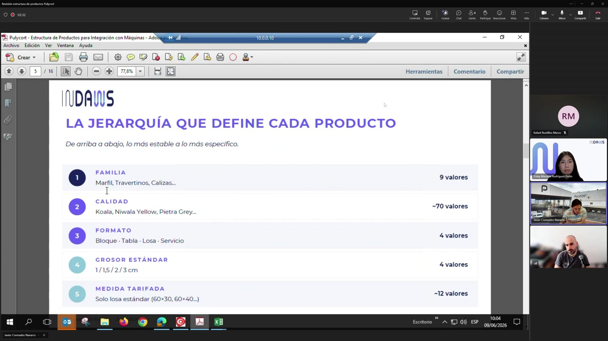
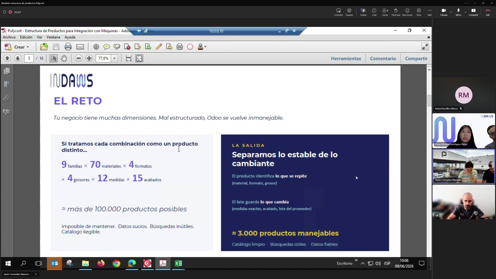
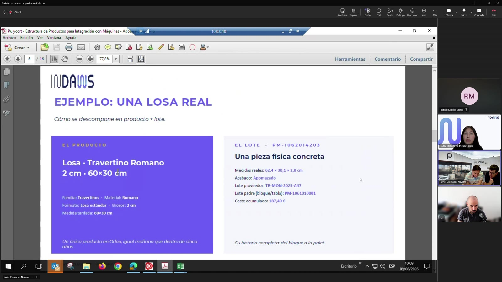
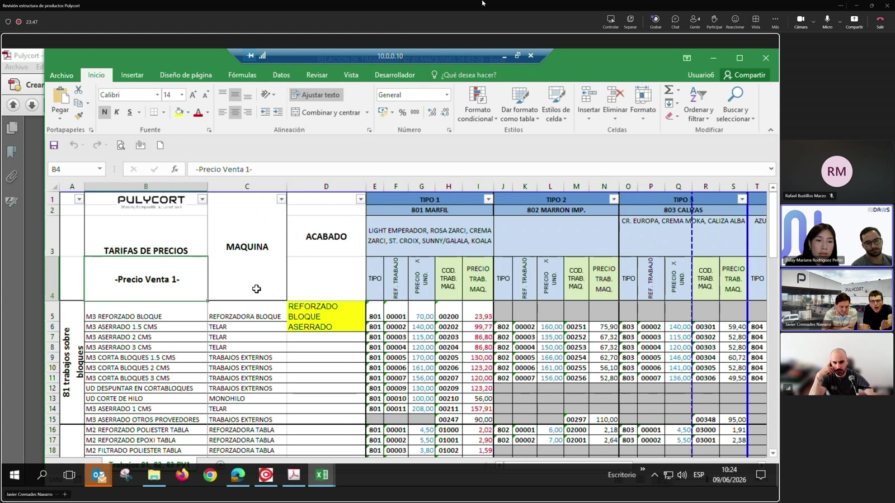
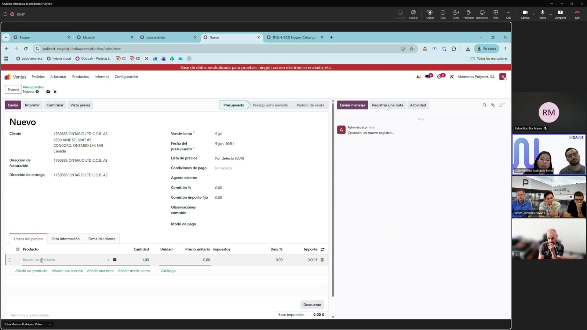

# Informe jerarquizado - Reunión Pulycort / IDDAMS

Fuente: `A:\TMC CLASES\TMC HARDCORE\2026-06-09 10-01-56.mkv`  
Duración del vídeo: 01:22:49.941. Audio útil transcrito: aprox. 00:00:00-00:57:33.  
Transcripción automática: modelo `faster-whisper small`, idioma español. Revisar nombres propios y términos dudosos.

## 1. Resumen ejecutivo

La reunión se centra en aclarar cómo debe estructurarse la jerarquía de productos en Odoo sin multiplicar productos innecesariamente, pero manteniendo trazabilidad, costes, precios de venta y stock.

La idea base es separar claramente:

- Producto/variante vendible o gestionable.
- Material y familia de material.
- Medida estándar frente a medida real o personalizada.
- Acabado como estado final del material, no necesariamente como operación.
- Trabajo de máquina / operación, artículo facturable y coste.
- Lote o número de serie como soporte de trazabilidad real.

Conclusión principal: la familia no debe formar parte visible de la jerarquía/código de producto si ya queda implícita por el material. Debe mantenerse como dato informativo/asociado para costes. Las medidas reales y especiales deben guardarse en lote, no crear una variante por cada medida imposible. El acabado queda como punto crítico: afecta a venta, coste y stock, y debe listarse bien para decidir cuándo será atributo/variante y cuándo dato de lote.

## 2. Jerarquía funcional propuesta

### 2.1 Producto base

Los productos se modelan como productos base con atributos que generan variantes.

Ejemplos mencionados:

- Bloque.
- Losa estándar.
- Losa personalizada o fuera de medida.
- Tabla.

En Odoo, el producto base se combina con atributos para generar variantes. Se explica con la idea de que los atributos son los "ingredientes" y la variante es la combinación final.

### 2.2 Atributos que generan variantes

Para una losa estándar se plantean estos atributos:

- Material: koala, caliza, rojo Alicante, travertino romano, negro máquina, crema moka, etc.
- Grosor estándar: se mencionan 1 cm, 1,5 cm, 2 cm y 3 cm para losas.
- Medida estándar: medidas tarifadas, se mencionan unas 13-14 medidas estándar.
- Acabado: pulido, apomazado, abujardado, bruto, reforzado con poliéster, etc. Este punto queda pendiente de cerrar con el listado completo.

### 2.3 Familia de material

La familia no debe aparecer como nivel adicional en el árbol o en el código visible si el material ya la determina.

Ejemplo:

- Material koala -> familia marfil.
- Material caliza -> familia caliza.
- Material travertino romano -> familia travertino.

Uso de la familia:

- Dato informativo en la ficha/variante.
- Agrupación interna para cálculo de costes.
- No debería contaminar la descripción comercial si ya está implícita en el material.

## 3. Medidas: estándar, real y personalizada

### 3.1 Medidas estándar

Las medidas estándar son las tarifadas y pueden formar parte de la variante.

Ejemplo:

- Losa estándar.
- Material koala.
- Grosor estándar 2 cm.
- Medida estándar 60 x 30.

Estas variantes sirven para consultar stock, tarifas y ventas de medidas comunes.

### 3.2 Medidas reales

Las medidas reales que salen de los procesos no deben forzar nuevas variantes si difieren ligeramente de la estándar.

Ejemplos mencionados:

- 62,4 x 30,1.
- 61,5 x 61,5.
- Medidas de merma, pico roto o recuperación.

Decisión funcional:

- Guardar largo, ancho, grueso y volumen en el lote/número de serie.
- Usar descripción de línea en pedido/factura cuando haga falta reflejar la medida exacta.
- Mantener trazabilidad por lote sin crear miles de variantes.

### 3.3 Producto personalizado

Para medidas fuera de tarifa se propone usar un valor tipo "personalizado" en la medida estándar o un producto genérico de medida personalizada.

Ejemplo:

- Losa estándar personalizada.
- Material X.
- Grosor estándar Y.
- Medidas exactas guardadas en el lote y/o descripción.

Objetivo: no ensuciar Odoo con una variante por cada medida especial.

## 4. Acabados y operaciones

### 4.1 No confundir operación con acabado

Punto clave de la reunión: "aserrado" es una operación/trabajo, no necesariamente el acabado final.

Ejemplo aclarado:

- Un bloque entra al telar/sierras.
- La operación es aserrar.
- El resultado puede seguir siendo material en bruto.
- Por tanto, el acabado resultante no debe llamarse "aserrado" si lo que queda en stock es bruto.

Otro ejemplo:

- Una tabla entra en bruto en una máquina reforzadora.
- Sale reforzada con poliéster.
- En ese caso el acabado resultante sí cambia.

### 4.2 Acabado por lote

Se plantea que el acabado real del material debe quedar en lote, porque puede cambiar en cada proceso.

El lote permitiría saber:

- Qué producto/variante es.
- Qué largo, ancho, grueso y volumen tiene.
- Qué acabado tiene en ese momento.
- En qué ubicación está.

### 4.3 Acabado como atributo/variante

También se detecta una tensión importante: si el acabado sólo vive en el lote, Odoo puede no saber en el pedido de venta qué acabado se venderá hasta elegir lote en el albarán. Eso complica precio, pedido y factura.

Por eso se plantea que el acabado quizá deba incorporarse como atributo/variante cuando sea necesario para venta/tarifa/stock. El problema es que multiplica el número de productos, posiblemente de unos 3.000 a 10.000-15.000.

Estado: punto abierto, dependiente de recibir el listado completo de acabados y validar el flujo comercial.

## 5. Costes, trabajos y artículos facturables

### 5.1 Código de trabajo

Los códigos comentados no son códigos de stock. Son códigos internos de trabajo/coste/artículo facturable.

Ejemplos mencionados:

- Trabajo sobre bloques.
- Aserrado 2 cm.
- Reforzado de bloque.
- Pulido de tabla.
- Corte en disco puente.

El operario no ve necesariamente códigos; en máquina puede ver desplegables como pulido, apomazado o abujardado. Los códigos pertenecen al sistema anterior o al mapeo interno.

### 5.2 Trabajo, familia y coste

El coste directo depende del trabajo realizado y de la familia/material.

Ejemplo conceptual:

- Pulir material de familia marfil puede tener un coste fijo.
- Pulir material de familia travertino puede tener otro coste.
- Si hay 6 trabajos y 8 familias, se generan combinaciones trabajo x familia.

Se recalca que el tiempo empleado no entra directamente en ese precio fijo; el coste se calcula por el trabajo/familia/unidad.

### 5.3 Unidades de medida

Los trabajos pueden medirse de forma distinta:

- m3 para bloques.
- m2 para tablas/losas.
- operación fija para determinados trabajos, como despuntar.

Ejemplo de acumulación:

- Pulido suma un coste por m2.
- Corte posterior suma otro coste por m2.
- El coste se va acumulando según los trabajos por los que pasa el material.

### 5.4 Coste directo e indirecto

La tabla comentada contiene costes directos del trabajo. Se indica que habría que añadir costes indirectos de empresa por separado.

## 6. Flujo Odoo y comercial

Flujo natural mencionado en Odoo:

1. Oportunidad.
2. Pedido de venta.
3. Albarán.
4. Factura.

Problema detectado:

- Si el acabado se decide sólo al elegir lote en el albarán, el pedido de venta todavía no lo conoce.
- Pero Pulycort trabaja tanto con stock disponible como bajo pedido.
- Para venta y precio puede ser necesario saber acabado antes del albarán.

Esto obliga a validar si acabado debe ser atributo de variante, dato de lote, o ambos con usos distintos.

## 7. Decisiones y acuerdos

1. Familia como dato informativo/coste, no como nivel visible de jerarquía si el material ya la determina.
2. El material genera variantes y arrastra/asocia su familia.
3. Las medidas estándar tarifadas pueden generar variantes.
4. Las medidas reales o especiales deben guardarse en lote y/o descripción, no crear una variante por cada caso.
5. El lote debe contener trazabilidad: largo, ancho, grueso, volumen y acabado real.
6. Aserrado debe tratarse como operación; el acabado resultante de ese proceso puede ser bruto.
7. Hay que mapear cada operación de máquina con el acabado resultante al final de esa operación.
8. Los códigos de trabajo/artículo facturable sirven para cálculo de costes y facturación, no para gestión de stock.
9. Los costes directos por trabajo/familia/unidad se acumulan según las operaciones realizadas.
10. Falta cerrar la decisión final sobre acabado como variante frente a acabado sólo en lote, porque impacta en pedido, precio, albarán y número de productos.

## 8. Puntos abiertos

- Listado completo de acabados.
- Relación operación de máquina -> acabado resultante.
- Validación de si acabado debe ser atributo generador de variante.
- Cómo mantener precio de venta si el acabado se conoce en pedido o sólo en albarán.
- Revisión de la tabla de costes con acabados añadidos.
- Revisión del cuestionario de dudas por máquina/campos.
- Confirmar qué preguntas del cuestionario requieren respuesta; se menciona que no todas las 82 filas/preguntas aplican.
- Preparar vista Odoo más clara para enseñar variantes personalizadas, lotes y medidas reales.

## 9. Próximos pasos

- Rafael enviará el enlace/página del portal con resúmenes de reuniones y puntos abiertos.
- Pulycort revisará/rellenará el cuestionario y lo enviará, idealmente el viernes 12 de junio de 2026.
- Pulycort reenviará la tabla de costes/trabajos añadiendo la columna o información de acabados resultantes.
- IDDAMS revisará esos documentos y ajustará la configuración/propuesta en Odoo.
- Se plantea revisar cambios el martes 16 de junio de 2026.
- La reunión del jueves 11 de junio de 2026 parece reservada para CRM/ventas: ficha de clientes, campos obligatorios y formato de proforma/presupuesto.

## 10. Capturas clave

### Jerarquía de producto

### Reto de configuración y productos resultantes

### Ejemplo de producto/losa real

### Matriz de trabajos, familias y costes

### Revisión de producto/lotesserie en Odoo

## 11. Archivos generados

- Transcripción completa: `transcript.md`
- Transcripción plana: `transcript.txt`
- Segmentos JSON: `transcript_segments.json`
- Subtítulos: `subtitles.srt`, `subtitles.vtt`
- Capturas: `screenshots/`
- Hojas de contacto: `contact_sheets/`
- Metadatos: `metadata.json`, `run_summary.json`
